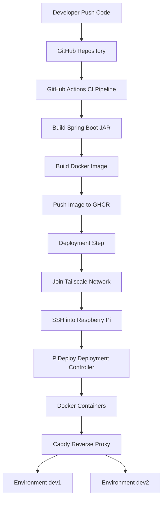
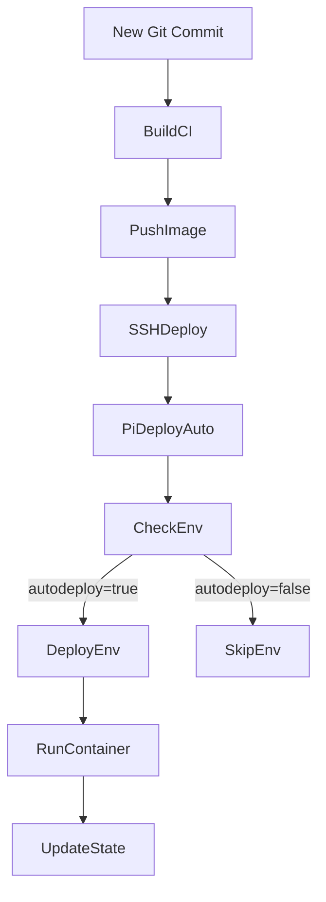
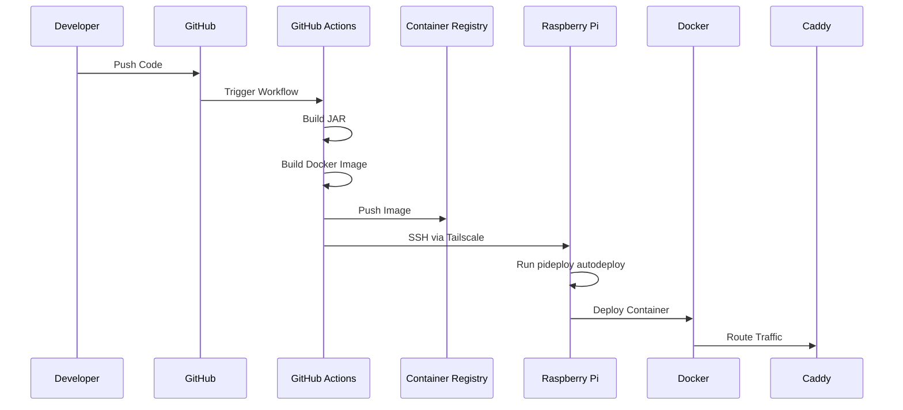

# PiDeploy Platform – Complete Setup & Architecture Documentation

Author: Kaustav Paul

Platform: Raspberry Pi Dev Platform

Purpose: Self-hosted CI/CD deployment platform for containerized applications

---

# 1. Overview

This document explains the **complete architecture and setup** of a self-hosted deployment platform running on a **Raspberry Pi**.

The platform enables:

* Automated CI/CD deployments
* Multiple deployment environments
* Manual or automatic deployments
* Reverse-proxy based routing
* GitHub Actions integration
* Container registry based deployments

The platform behaves similarly to lightweight PaaS systems like:

* Heroku
* Render
* Fly.io
* Railway

but is fully **self-hosted on a Raspberry Pi**.

---

# 2. System Architecture

The platform consists of the following components.

| Component                        | Purpose                       |
| -------------------------------- | ----------------------------- |
| Raspberry Pi                     | Self-hosted deployment server |
| Docker                           | Container runtime             |
| GitHub Actions                   | CI/CD pipeline                |
| GHCR (GitHub Container Registry) | Docker image registry         |
| Tailscale                        | Secure network access         |
| Caddy                            | Reverse proxy                 |
| PiDeploy                         | Custom deployment controller  |

---

# 3. High Level Architecture



---

# 4. Raspberry Pi Infrastructure Setup

The Raspberry Pi acts as the **deployment host**.

## Hardware

```
Raspberry Pi 4
RAM: 4GB
Storage: 1TB HDD
OS: Ubuntu Server
```

---

# 5. Installed Infrastructure Components

### Docker

Docker is used as the container runtime.

Installed via:

```
curl -fsSL https://get.docker.com | sh
```

Docker enables:

* isolated deployments
* containerized applications
* easy rollbacks
* predictable environments

---

### Caddy Reverse Proxy

Caddy handles incoming HTTP requests and routes them to the correct environment.

Benefits:

* automatic configuration
* lightweight
* container friendly
* simple routing rules

---

### Tailscale

Tailscale is used for **secure remote connectivity**.

Reason:

Raspberry Pi runs behind home NAT.
Opening SSH ports to the public internet is unsafe.

Tailscale provides:

* private mesh VPN
* secure SSH access
* encrypted connectivity

---

# 6. Directory Structure

```
/srv
 ├── infrastructure
 │   ├── caddy
 │   └── postgres
 │
 ├── environments
 │   ├── dev1
 │   └── dev2
 │
 └── pideploy
     ├── pideploy
     └── state.json
```

---

# 7. Docker Network

All containers share a common network.

```
docker network create platform
```

Purpose:

* Caddy can route to containers by name
* environments communicate internally
* cleaner networking

---

# 8. Caddy Reverse Proxy Configuration

File:

```
/srv/infrastructure/caddy/Caddyfile
```

Configuration:

```
:80 {

    redir /dev1 /dev1/

    handle_path /dev1/* {
        reverse_proxy dev1-app:8080
    }

    redir /dev2 /dev2/

    handle_path /dev2/* {
        reverse_proxy dev2-app:8080
    }

}
```

---

# 9. Environment Routing

Example URLs:

| Environment | URL     |
| ----------- | ------- |
| dev1        | `/dev1` |
| dev2        | `/dev2` |

Example:

```
https://pi.tail9f065e.ts.net/dev1/hello
```

---

# 10. PiDeploy – Custom Deployment Controller

PiDeploy is a custom CLI tool controlling deployments.

Location:

```
/srv/pideploy/pideploy
```

Command exposed globally:

```
/usr/local/bin/pideploy
```

Created using symlink:

```
sudo ln -s /srv/pideploy/pideploy /usr/local/bin/pideploy
```

---

# 11. PiDeploy Responsibilities

PiDeploy manages:

* container deployments
* environment state
* auto deploy rules
* commit tracking

State stored in:

```
/srv/pideploy/state.json
```

Example state file:

```
{
  "dev1": {
    "commit": "abc123",
    "autodeploy": true
  }
}
```

---

# 12. PiDeploy Commands

### Deploy specific commit

```
pideploy deploy dev1 <commit>
```

Example:

```
pideploy deploy dev1 93d3fcd6391fab1b5d53824b09e3bcbae4b773ae
```

---

### Enable auto deploy

```
pideploy dev1 autodeploy
```

Output:

```
Latest commit will be deployed in dev1
```

---

### Check environment status

```
pideploy get dev1
```

Example output:

```
Environment : dev1
Commit      : 93d3fcd6391fab1b5d53824b09e3bcbae4b773ae
Auto deploy : true
```

---

### Auto deploy from CI

Used by GitHub Actions.

```
pideploy autodeploy <commit>
```

Behavior:

* checks all environments
* deploys only environments with `autodeploy=true`

---

# 13. Deployment Process



---

# 14. Container Deployment

Each environment runs its own container.

Example:

```
dev1-app
dev2-app
```

Container start command:

```
docker run -d \
--name dev1-app \
--restart always \
--network platform \
ghcr.io/kaustav1999paul/fithub-test:<commit>
```

---

# 15. GitHub Container Registry

Images are stored in:

```
ghcr.io/kaustav1999paul/fithub-test
```

Two tags are pushed:

```
latest
commit-hash
```

Example:

```
ghcr.io/kaustav1999paul/fithub-test:latest
ghcr.io/kaustav1999paul/fithub-test:93d3fcd
```

---

# 16. GitHub Actions CI/CD Pipeline

File:

```
.github/workflows/deploy.yml
```

Full working configuration:

```yaml
name: Build & Deploy Test Backend

on:
  push:
    branches:
      - main

permissions:
  contents: read
  packages: write

jobs:

  build-and-deploy:
    runs-on: ubuntu-latest

    steps:

      - name: Checkout code
        uses: actions/checkout@v4

      - name: Setup JDK
        uses: actions/setup-java@v4
        with:
          distribution: temurin
          java-version: 25

      - name: Build JAR
        run: |
          chmod +x gradlew
          ./gradlew clean bootJar

      - name: Log in to GitHub Container Registry
        uses: docker/login-action@v3
        with:
          registry: ghcr.io
          username: ${{ github.actor }}
          password: ${{ secrets.GITHUB_TOKEN }}

      - name: Set up Docker Buildx
        uses: docker/setup-buildx-action@v3

      - name: Build and push multi-arch image
        uses: docker/build-push-action@v5
        with:
          context: .
          push: true
          tags: |
            ghcr.io/kaustav1999paul/fithub-test:latest
            ghcr.io/kaustav1999paul/fithub-test:${{ github.sha }}
          platforms: linux/amd64,linux/arm64

      - name: Connect to Tailscale
        uses: tailscale/github-action@v2
        with:
          authkey: ${{ secrets.TAILSCALE_AUTHKEY }}

      - name: Deploy to Raspberry Pi
        run: |
          mkdir -p ~/.ssh
          echo "${{ secrets.PI_SSH_KEY }}" > ~/.ssh/id_rsa
          chmod 600 ~/.ssh/id_rsa

          ssh -o StrictHostKeyChecking=no \
              ${{ secrets.PI_USER }}@pi.tail9f065e.ts.net \
              "pideploy autodeploy ${{ github.sha }}"
```

---

# 17. CI/CD Execution Flow



---

# 18. Benefits of This Architecture

### Fully self-hosted

No dependency on cloud deployment platforms.

---

### Multi environment support

```
/dev1
/dev2
```

Multiple branches or versions can run simultaneously.

---

### Controlled deployments

Supports:

* manual deploy
* automatic deploy

---

### GitOps friendly

All deployments originate from Git commits.

---

### Secure

Uses:

* private Tailscale network
* no public SSH exposure

---

# 19. Future Improvements

Possible extensions:

```
pideploy list
pideploy logs dev1
pideploy rollback dev1
pideploy create env
pideploy delete env
```

Potential upgrades:

* automatic preview environments
* branch based deployments
* container health checks
* deployment dashboard

---

# 20. Final Result

You now have a **self-hosted deployment platform** capable of:

* CI/CD pipelines
* multi-environment deployments
* containerized infrastructure
* Git-based deployments
* secure remote management

All running on a **Raspberry Pi**.

---
