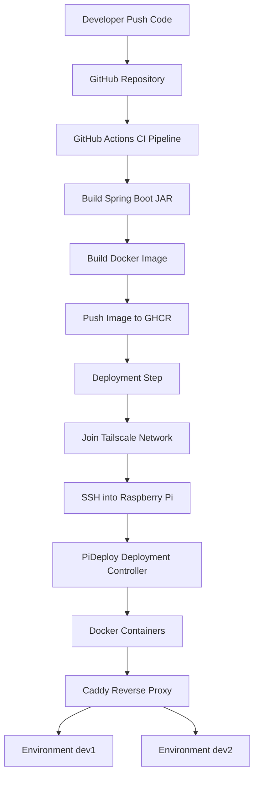

# Raspberry Pi CI/CD Platform with PiDeploy

## Overview
Complete step-by-step guide to rebuild the Raspberry Pi CI/CD deployment platform.

Includes:
- Docker runtime
- Caddy reverse proxy
- Tailscale networking
- PiDeploy deployment controller
- GitHub Actions CI/CD pipeline

Follow the commands sequentially to recreate the system from scratch.

---

## High Level Architecture



---

## Directory Layout

```
/srv
 ├── infrastructure
 │    ├── caddy
 │    └── postgres
 │
 ├── environments
 │    ├── dev1
 │    └── dev2
 │
 └── pideploy
      ├── pideploy
      └── state.json
```

---

# Raspberry Pi Setup

## Update system

```bash
sudo apt update
sudo apt upgrade -y
```

## Install utilities

```bash
sudo apt install git curl jq -y
```

---

# Install Docker

```bash
curl -fsSL https://get.docker.com | sh
sudo usermod -aG docker $USER
sudo reboot
```

Verify docker

```bash
docker version
```

---

# Install Docker Compose

```bash
sudo apt install docker-compose-plugin
```

---

# Create directories

```bash
sudo mkdir -p /srv/infrastructure
sudo mkdir -p /srv/environments
sudo mkdir -p /srv/pideploy
```

---

# Create docker network

```bash
docker network create platform
```

---

# Setup Caddy

Create folder

```bash
mkdir -p /srv/infrastructure/caddy
```

Create file

```
/srv/infrastructure/caddy/Caddyfile
```

Content

```
:80 {

    redir /dev1 /dev1/

    handle_path /dev1/* {
        reverse_proxy dev1-app:8080
    }

    redir /dev2 /dev2/

    handle_path /dev2/* {
        reverse_proxy dev2-app:8080
    }

}
```

Run Caddy

```bash
docker run -d --name caddy --restart always --network platform -p 80:80 -v /srv/infrastructure/caddy/Caddyfile:/etc/caddy/Caddyfile caddy
```

---

# Install Tailscale

```bash
curl -fsSL https://tailscale.com/install.sh | sh
sudo tailscale up
tailscale status
```

Enable funnel

```bash
sudo tailscale funnel 80
```

---

# Enable SSH

```bash
sudo systemctl enable ssh
sudo systemctl start ssh
```

---

# PiDeploy Script

File

```
/srv/pideploy/pideploy
```

Make executable

```bash
chmod +x /srv/pideploy/pideploy
```

---

# Create global command

```bash
sudo ln -s /srv/pideploy/pideploy /usr/local/bin/pideploy
```

---

# Create state file

```bash
echo '{}' > /srv/pideploy/state.json
```

---

# GitHub Actions Workflow

`.github/workflows/deploy.yml`

```yaml
name: Build & Deploy Backend

on:
  push:
    branches:
      - main

permissions:
  contents: read
  packages: write

jobs:

  build-and-deploy:
    runs-on: ubuntu-latest

    steps:

      - uses: actions/checkout@v4

      - uses: actions/setup-java@v4
        with:
          distribution: temurin
          java-version: 25

      - name: Build JAR
        run: |
          chmod +x gradlew
          ./gradlew clean bootJar

      - uses: docker/login-action@v3
        with:
          registry: ghcr.io
          username: ${{ github.actor }}
          password: ${{ secrets.GITHUB_TOKEN }}

      - uses: docker/setup-buildx-action@v3

      - uses: docker/build-push-action@v5
        with:
          context: .
          push: true
          tags: |
            ghcr.io/kaustav1999paul/fithub-test:latest
            ghcr.io/kaustav1999paul/fithub-test:${{ github.sha }}
          platforms: linux/amd64,linux/arm64

      - name: Deploy
        uses: appleboy/ssh-action@v1.0.3
        with:
          host: pi.tailXXXX.ts.net
          username: ${{ secrets.PI_USER }}
          key: ${{ secrets.PI_SSH_KEY }}
          script: |
            sleep 5
            pideploy autodeploy ${{ github.sha }}
```

---

# Deployment Commands

Manual deploy

```
pideploy deploy dev1 <commit-hash>
```

Enable auto deploy

```
pideploy dev1 autodeploy
```

Check deployment

```
pideploy get dev1
```

---

# Example URLs

```
https://pi.tailXXXX.ts.net/dev1/hello
https://pi.tailXXXX.ts.net/dev2/hello
```
